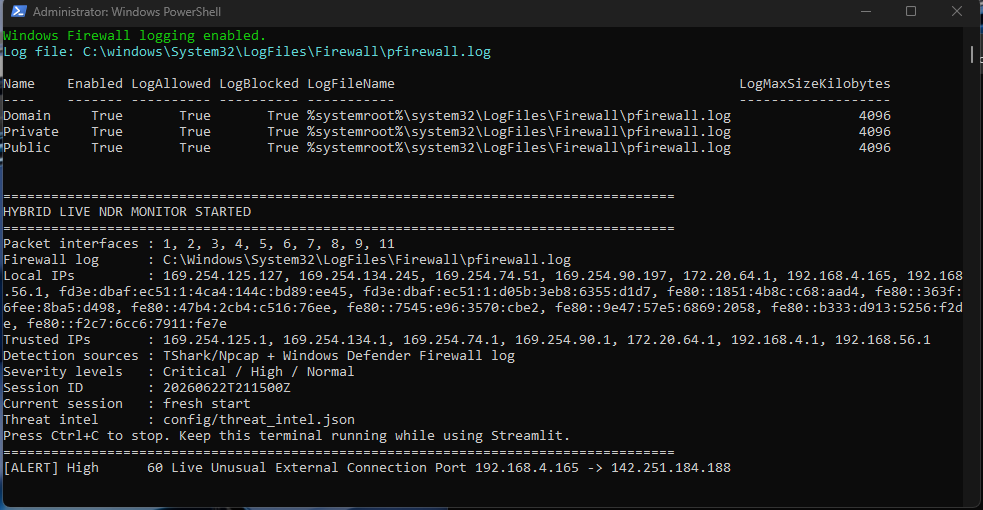
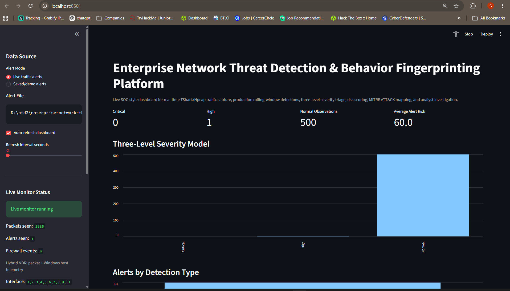
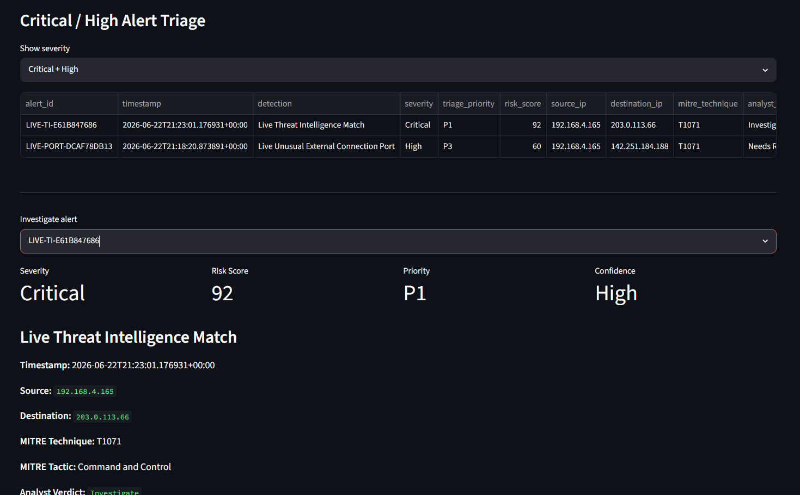
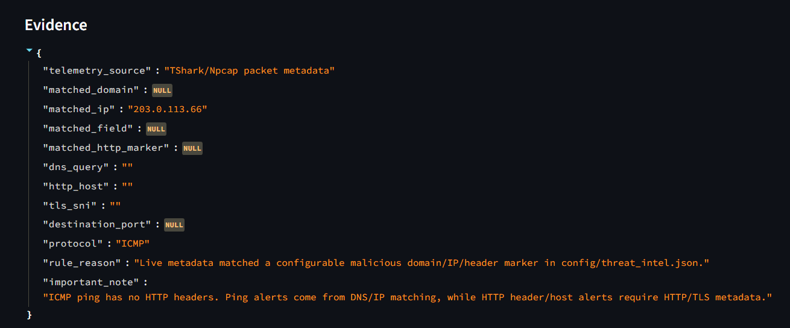
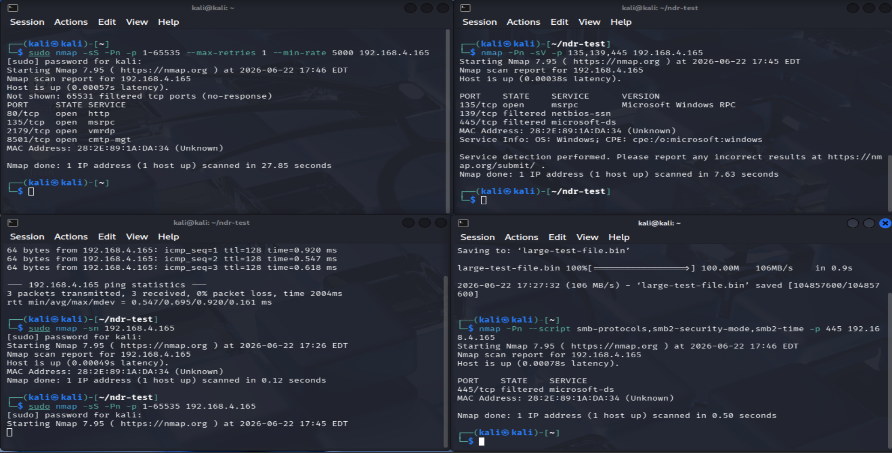
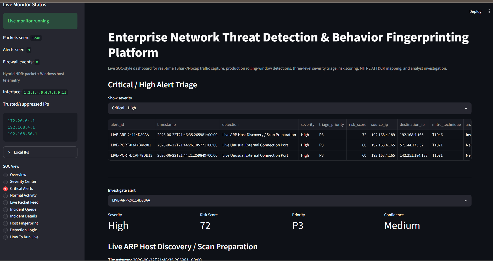
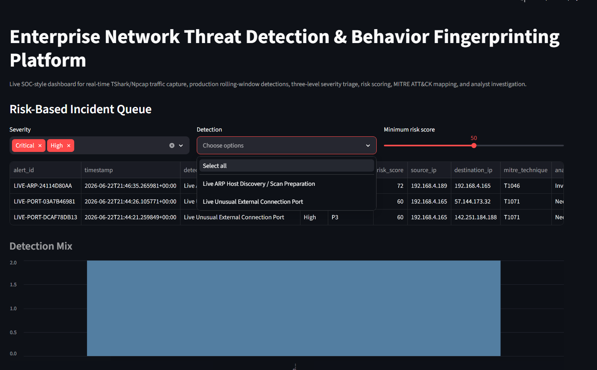
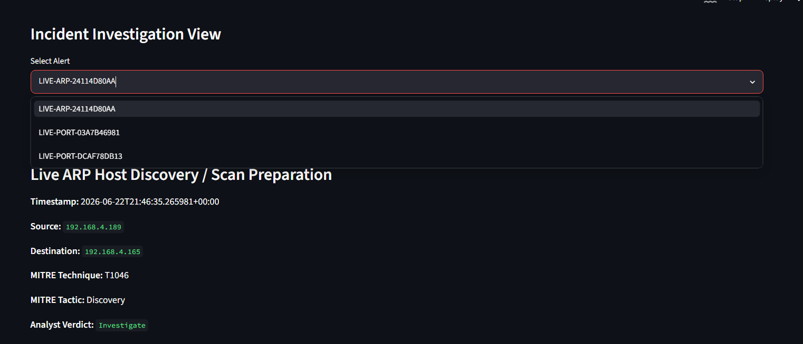
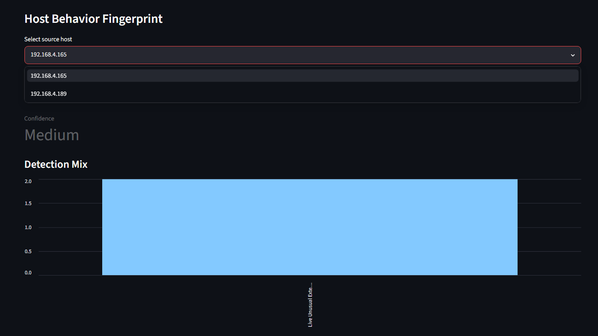

# Enterprise Network Threat Detection & Behavior Fingerprinting Platform

A live **Hybrid Network Detection and Response (NDR)** prototype built for SOC-style monitoring, alert triage, and interview-ready cybersecurity project proof. The platform captures live packet metadata using **TShark/Npcap**, enriches it with **Windows Defender Firewall telemetry**, applies rule-based detections, maps alerts to **MITRE ATT&CK**, and displays evidence in a **Streamlit SOC dashboard**.

> This project is for controlled lab testing and learning. Run tests only against systems you own or have permission to monitor.

---

## Project Summary

The goal of this project is to demonstrate how a SOC analyst or detection engineer can collect live network telemetry, classify normal activity, detect suspicious behavior, and investigate alerts from one dashboard.

The current implementation focuses on:

- Live multi-interface packet capture with TShark/Npcap
- Windows Defender Firewall log enrichment
- Threat-intelligence matching from a configurable IOC file
- Critical / High / Normal severity classification
- MITRE ATT&CK mapping
- Incident queue and investigation workflow
- Host behavior fingerprinting
- Normal activity visibility
- Evidence-based alert details for analyst triage

---

## Why I Built This

Packet capture alone does not always detect every attack, especially when traffic is encrypted, blocked, routed through a VM, or not visible to the local network sensor. This project demonstrates a realistic detection-engine approach by combining packet metadata, firewall evidence, threat-intelligence indicators, and SOC-style triage logic.

During testing, the project successfully demonstrated live alerts for threat-intelligence matches, unusual outbound connections, ARP-based host discovery, and normal activity classification.

---

## Architecture

```text
Windows Host
 ├── TShark/Npcap packet metadata
 ├── Windows Defender Firewall logs
 ├── Threat-intel config file
 └── Hybrid monitor process

Detection Engine
 ├── Threat-intel matcher
 ├── Unusual external port detection
 ├── ARP host-discovery detection
 ├── DNS anomaly checks
 ├── File-transfer / ad-hoc service checks
 ├── Risk scoring
 └── MITRE ATT&CK mapping

Dashboard
 ├── Overview / severity center
 ├── Critical and high alerts
 ├── Incident queue
 ├── Incident details
 ├── Evidence section
 ├── Host behavior fingerprint
 └── Live packet / normal activity views
```

---

## Key Features

| Feature | Description |
|---|---|
| Live packet capture | Captures packet metadata using TShark/Npcap across selected or all interfaces. |
| Hybrid telemetry | Combines packet metadata with Windows firewall log evidence. |
| Threat intelligence | Matches live DNS, IP, TLS/HTTP metadata against `config/threat_intel.json`. |
| Severity triage | Classifies events as Critical, High, or Normal. |
| MITRE mapping | Maps detections to MITRE ATT&CK techniques such as T1071 and T1046. |
| Incident queue | Shows prioritized alerts for analyst review. |
| Evidence view | Displays why the alert fired and what fields matched. |
| Host fingerprint | Summarizes alert activity by source host. |
| Normal activity | Shows benign observed traffic without treating everything as an alert. |

---

## Confirmed Detection Proof

The proof screenshots in the `proofs/` folder demonstrate the following working detections:

| Detection | Severity | MITRE | Proof |
|---|---:|---|---|
| Live Threat Intelligence Match | Critical | T1071 | IOC/domain/IP match evidence |
| Live Unusual External Connection Port | High | T1071 | Outbound uncommon port behavior |
| Live ARP Host Discovery / Scan Preparation | High | T1046 | Reconnaissance/host-discovery behavior |
| Normal Live Packet Metadata | Normal | N/A | Browsing and regular packet visibility |
| Incident Investigation View | N/A | N/A | Evidence, verdict, recommended action |
| Host Behavior Fingerprint | N/A | N/A | Source-host alert summary |

---

## Screenshots

Place proof screenshots inside the `proofs/` folder. The current README uses these image paths. If your screenshot names are different, rename them or update the links below.

### Live Monitor Started



### Dashboard Overview and Severity Center



### Critical Threat Intelligence Match



### Alert Evidence Section



### Kali / External Test Evidence



### High ARP Host Discovery Alert



### Incident Queue



### Incident Investigation View



### Host Behavior Fingerprint



---

## Project Structure

```text
enterprise-network-threat-detection-platform-HYBRID-NDR-SESSION-THREATINTEL/
├── config/
│   └── threat_intel.json
├── detection_engine/
├── host_telemetry/
├── hybrid_monitor/
├── live_monitor/
├── streamlit_app/
│   └── app.py
├── scripts/
│   ├── clear_live_data.ps1
│   ├── enable_windows_firewall_logging.ps1
│   ├── show_live_alerts.ps1
│   └── test_threat_intel.ps1
├── docs/
├── attack_simulation/
├── reports/
├── proofs/
├── requirements.txt
└── README.md
```

---

## Requirements

- Windows 10/11
- Python 3.10+
- Wireshark with TShark installed
- Npcap installed
- PowerShell running as Administrator for live capture and firewall logging
- Optional: Kali Linux VM or another device for attack simulation

Verify TShark:

```powershell
tshark -v
```

If TShark is not recognized, add Wireshark to the current PowerShell session path:

```powershell
$env:Path = "C:\Program Files\Wireshark;" + $env:Path
```

---

## Setup

Open **PowerShell as Administrator** from the project root:

```powershell
python -m venv .venv
.\.venv\Scripts\Activate.ps1
python -m pip install --upgrade pip
pip install -r requirements.txt
```

Enable Windows Firewall logging:

```powershell
.\scripts\enable_windows_firewall_logging.ps1
```

---

## Running the Project

### Terminal 1 — Start Live Hybrid Monitor

Open **PowerShell as Administrator**:

```powershell
cd "D:\ntd2\enterprise-network-threat-detection-platform-HYBRID-NDR-SESSION-THREATINTEL\enterprise-network-threat-detection-platform-HYBRID-NDR-SESSION-THREATINTEL"
.\.venv\Scripts\Activate.ps1
.\scripts\clear_live_data.ps1
python -m hybrid_monitor.run_hybrid_monitor --interface all
```

Keep this terminal running.

### Terminal 2 — Start Dashboard

Open a second PowerShell terminal:

```powershell
cd "D:\ntd2\enterprise-network-threat-detection-platform-HYBRID-NDR-SESSION-THREATINTEL\enterprise-network-threat-detection-platform-HYBRID-NDR-SESSION-THREATINTEL"
.\.venv\Scripts\Activate.ps1
python -m streamlit run streamlit_app/app.py
```

Open:

```text
http://localhost:8501
```

In the sidebar, select:

```text
Live traffic alerts
```

---

## Safe Validation Tests

### 1. Critical: Threat Intelligence IP Match

Run from the Windows host:

```powershell
ping 203.0.113.66 -n 3
```

Expected alert:

```text
Live Threat Intelligence Match
Severity: Critical
MITRE: T1071
```

### 2. High: Unusual External Connection Port

Run from the Windows host:

```powershell
Test-NetConnection 57.144.173.32 -Port 5222
```

Expected alert:

```text
Live Unusual External Connection Port
Severity: High
MITRE: T1071
```

### 3. High: ARP Host Discovery / Scan Preparation

Run from Kali or another authorized test device:

```bash
sudo nmap -sn 192.168.4.165
```

Expected alert:

```text
Live ARP Host Discovery / Scan Preparation
Severity: High
MITRE: T1046
```

### 4. Normal Activity Visibility

Run from the Windows host:

```powershell
curl https://example.com
```

Expected result:

```text
Normal Activity / Live Packet Feed visibility
No Critical or High alert unless suspicious behavior is detected
```

### 5. Show Alerts in PowerShell

```powershell
.\scripts\show_live_alerts.ps1
```

Or manually:

```powershell
Get-Content data\alerts\live_alerts.json |
ConvertFrom-Json |
Select-Object timestamp,severity,risk_score,detection,source_ip,destination_ip,mitre_technique |
Format-Table -AutoSize
```

---

## Threat Intelligence Configuration

Threat indicators are stored in:

```text
config/threat_intel.json
```

The detector can match against configured domains, IP addresses, and visible HTTP/TLS/DNS metadata. ICMP ping does not contain HTTP headers, so ping-based detections use IP matching.

Example detections:

```text
malicious.test → domain/HTTP Host/DNS indicator
203.0.113.66 → IP indicator
```

---

## What This Project Proves

This project proves that a live SOC-style detection workflow can be built using open-source tooling and Python:

```text
Live traffic generated
→ packet/firewall telemetry collected
→ detection rule matched
→ risk score assigned
→ MITRE technique mapped
→ alert shown in dashboard
→ analyst reviews evidence and host fingerprint
```

---

## Limitations

This project should be described honestly as a **hybrid NDR prototype**, not a full enterprise IDS/EDR replacement.

Known limitations:

- A single Windows packet sensor cannot see all traffic from every device on the network.
- Encrypted HTTPS traffic does not expose full URL paths or HTTP headers.
- Some VM-to-host traffic may not be fully visible to Npcap.
- SMB/RDP/PowerShell/credential attacks require endpoint logs such as Sysmon and Windows Security Events for reliable detection.
- Normal browsing is intentionally treated as normal activity to avoid alert flooding.

---

## Future Improvements

Planned next upgrades:

- Add Sysmon telemetry collector
- Add Windows Security Event Log detections
- Add PowerShell log detections
- Add Linux/Kali telemetry collector
- Add Zeek and Suricata log ingestion
- Add Sigma-style rules
- Add Elastic/OpenSearch/Wazuh integration
- Add alert grouping and incident correlation

---

## Interview Explanation

A concise way to explain this project:

> I built a hybrid network detection and incident triage platform using TShark/Npcap, Windows Defender Firewall logs, and Python-based detection logic. The platform captures live packet metadata, applies threat-intelligence and behavior-based rules, maps alerts to MITRE ATT&CK, and presents Critical, High, and Normal activity in a Streamlit SOC dashboard. During testing, I validated threat-intelligence matching, unusual outbound port detection, ARP-based host discovery, incident queueing, evidence capture, and host behavior fingerprinting. I also documented limitations around encrypted traffic and packet visibility, and planned the next phase with Sysmon, Windows Security logs, Zeek, and Suricata telemetry.

---

## Skills Demonstrated

- Network security monitoring
- Packet metadata analysis
- Threat-intelligence matching
- Windows firewall telemetry
- MITRE ATT&CK mapping
- SOC triage workflow
- Detection engineering
- False-positive tuning
- Python automation
- Streamlit dashboard development
- Incident evidence documentation

